# Data Processing Pipeline with Airflow and MongoDB

This project demonstrates a fully containerized **ETL pipeline** that processes reviews data using **Apache Airflow** and stores the cleaned data in **MongoDB**. The project is powered by **Docker** for containerization and uses **Pandas** for data transformation. MongoDB is used to store processed data, and analytical queries are executed directly within the database.

## Table of Contents
1. [Project Overview](#project-overview)
2. [Setup](#setup)
3. [DAG Overview](#dag-overview)
4. [MongoDB Analytics](#mongodb-analytics)

---

## 1. Project Overview

This project creates a **data pipeline** that performs the following steps:

1. **Data Ingestion**: The pipeline listens for the availability of a raw CSV file containing reviews data.
2. **Data Transformation**: The pipeline cleans and processes the data:
   - Handles missing values
   - Sorts the data by date
   - Cleans the content by removing unwanted characters
3. **Data Storage**: The processed data is stored in a **MongoDB** database in a `reviews` collection.
4. **Data Analysis**: Analytical queries are executed to:
   - Find the top 5 most frequent reviews
   - Filter reviews with content length less than 5 characters
   - Calculate the average score per day


## 2. Setup

```bash
docker compose build --no-cache
```

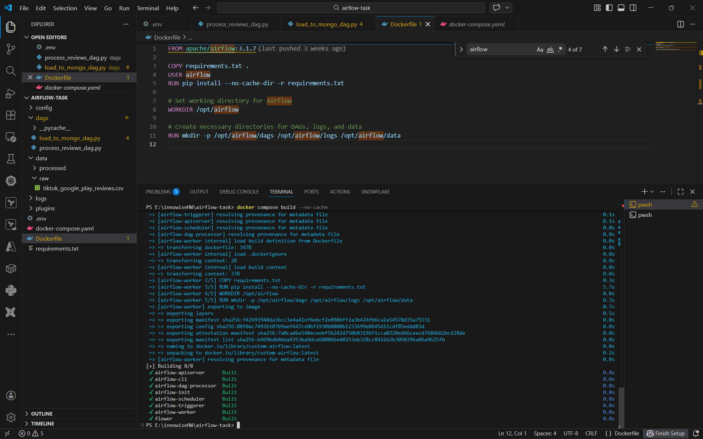


```bash
docker compose up airflow-init
```
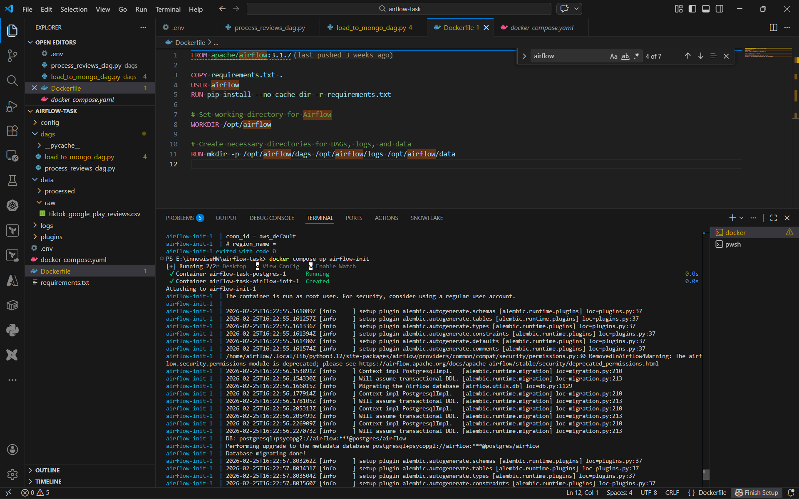

```bash
docker compose up
```
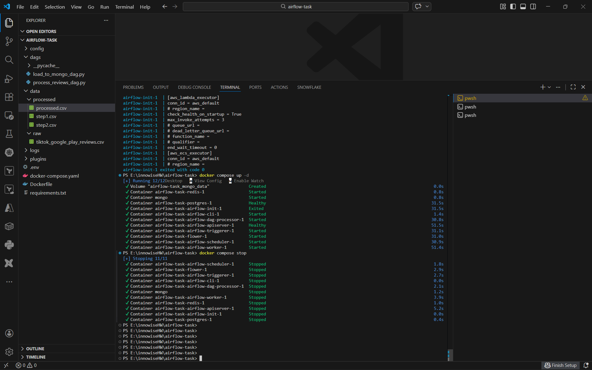

## 3. DAG Overview
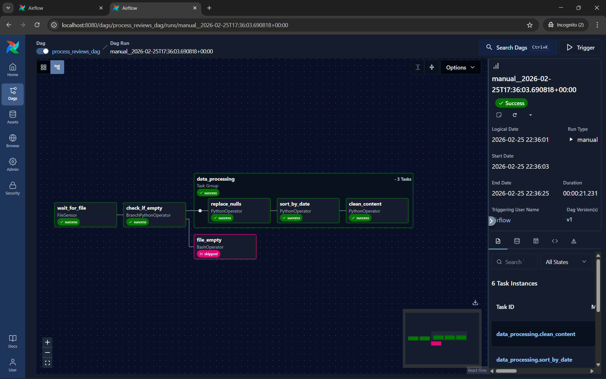
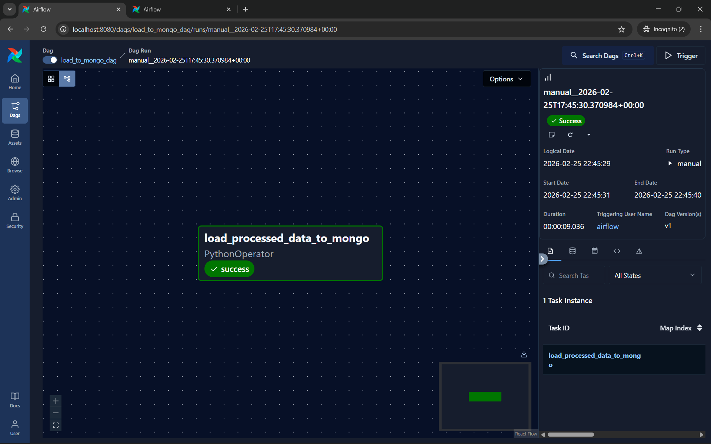
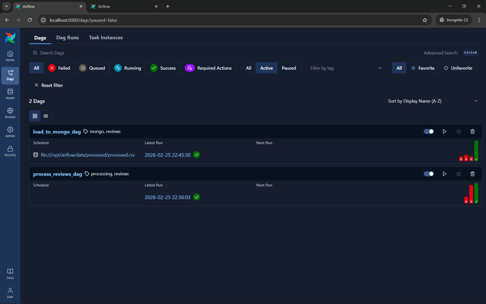
### Important note: we should add these two connections via admin > connection on UI
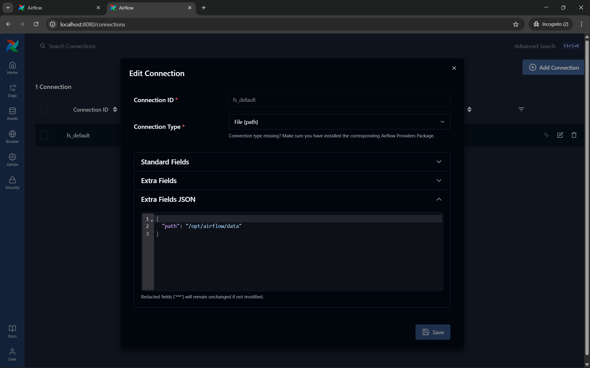
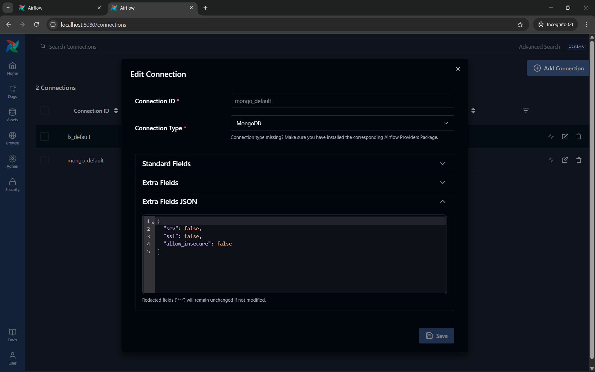


## 4. MongoDB Analytics
```bash
docker exec -it mongo mongosh
```
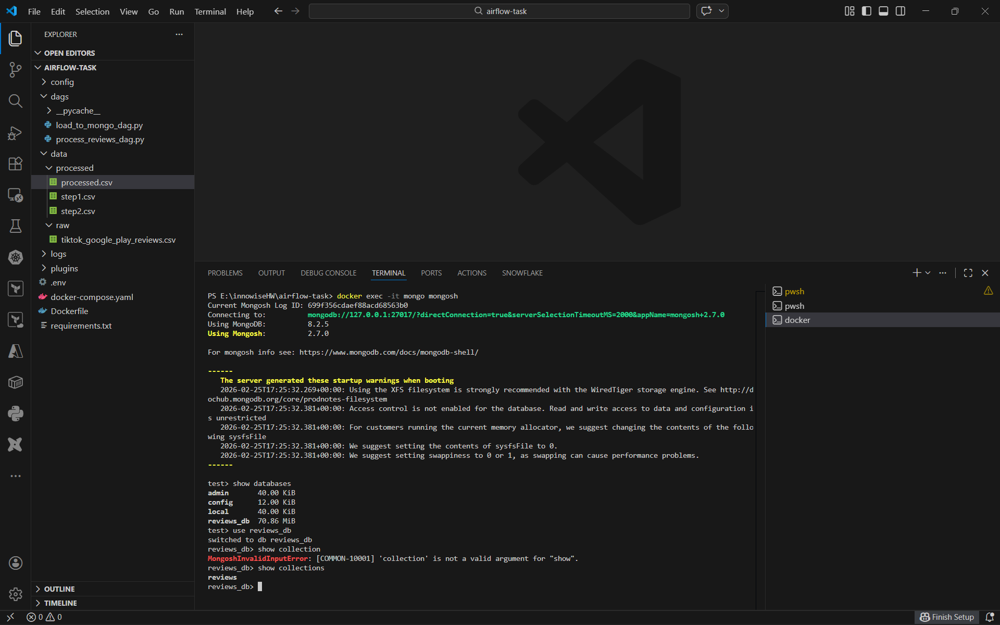


### Top 5 frequently occurring comments
```javascript
db.reviews.aggregate([
  { $group: { _id: "$content", count: { $sum: 1 } } },
  { $sort: { count: -1 } },
  { $limit: 5 }
])
```
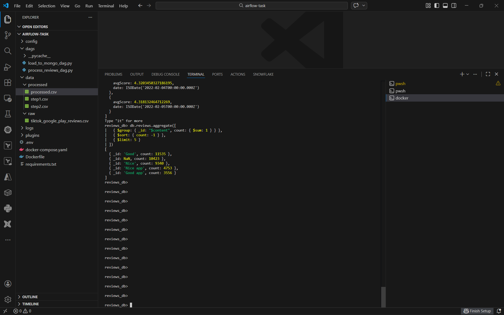

### All entries where the “content” field is less than 5 characters long;
```javascript
db.reviews.find({
  $expr: { $lt: [ { $strLenCP: "$content" }, 5 ] }
})
```
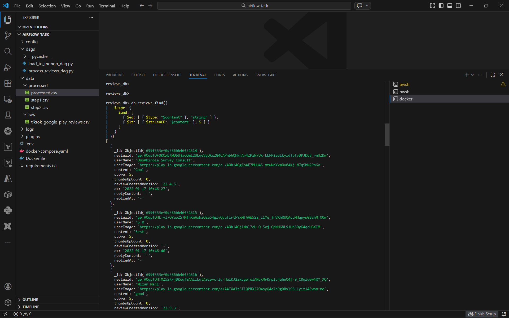

### Average rating for each day (the result should be in timestamp type).
```javascript
db.reviews.aggregate([
  { $group: {
    _id: { year: { $year: "$at" }, month: { $month: "$at" }, day: { $dayOfMonth: "$at" } },
    avgScore: { $avg: "$score" }
  }},
  { $project: {
    _id: 0,
    date: { $dateFromParts: { year: "$_id.year", month: "$_id.month", day: "$_id.day" } },
    avgScore: 1
  }},
  { $sort: { date: 1 } }
])
```
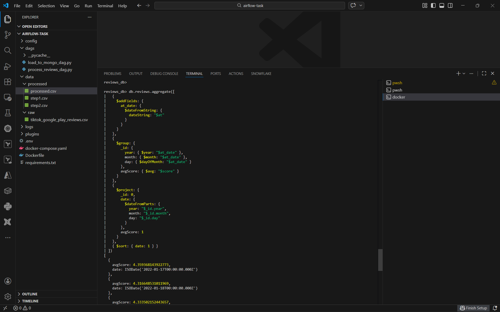

## Finishing up the work
```bash
docker compose down
```
